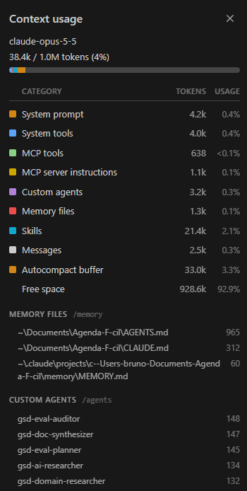

# Evidências do harness

Harness: **Claude Code**. Os trechos abaixo foram copiados da sessão de 03/10/2026 em que o
harness foi configurado. Caminhos absolutos da máquina foram trocados por `<repo>`.

As provas 1 e 3 vêm dessa sessão; as provas 2 e 4 vêm de uma sessão nova, aberta depois.

## 1. Permissão — leitura do `.env` recusada

Regra em `.claude/settings.json`: `"deny": ["Read(./.env)", ...]`.

Chamada feita pelo agente:

```
Read(file_path: <repo>\.env)
```

Resposta do harness:

```
File is in a directory that is denied by your permission settings.
```

A recusa veio do harness, não do agente: a ferramenta `Read` nem chegou a abrir o arquivo.

## 2. Skill — acionada sozinha em sessão nova

Sessão nova, aberta depois da configuração. Pedido feito, sem citar a skill:

```
garanta que o bloqueio de horário ocupado da RN-02 vale mesmo quando a data vem com espaços nas pontas
```

O agente acionou a skill `implementar-criterio-de-aceite` na primeira tentativa.
**Reescritas da descrição até funcionar: 0.**

Resposta final do agente, que segue os passos da skill (cita o critério, para no passo 3 porque o
teste novo já passava, e termina com a prova do passo 6):

```
O comportamento já existia: o teste novo passou de primeira, então não alterei src/ (passo 3 da skill).

Critério: CA-02 (RN-02) da SPEC 001.
Por que já funcionava: registrar aplica trim() na data e no horário antes de checar o conflito,
em src/agendamentos.js:34-43.
Arquivo alterado: só test/agendamentos.test.js, com o teste novo
"CA-02: bloqueia horário ocupado mesmo com espaços nas pontas da data". Nada foi commitado.
Saída da última execução de npm test e npm run lint:

> agenda-facil@0.1.0 test
> node --test

✔ CA-01: registra agendamento com horário disponível (1.0775ms)
✔ CA-02: bloqueia registro em data e horário já ocupados (0.3576ms)
✔ CA-02: bloqueia horário ocupado mesmo com espaços nas pontas da data (0.1252ms)
✔ RN-02 (borda): mesma data com horário diferente é aceito (0.5519ms)
✔ CA-03: bloqueia e informa quais campos obrigatórios faltam (0.232ms)
✔ CA-04: agendamento registrado aparece na lista com os mesmos dados (0.1071ms)
ℹ tests 6
ℹ pass 6
ℹ fail 0

> agenda-facil@0.1.0 lint
> eslint .

O lint terminou sem erros, e o hook pós-edição confirmou: [hook] npm run lint: sem erros.

Evidência da skill: a skill foi acionada nesta sessão nova na primeira tentativa (0 reescritas da
descrição). Ressalva: o CLAUDE.md cita a skill pelo nome para esse tipo de tarefa, então o
acionamento não veio só da descrição dela.
```

**Ressalva.** Como o próprio agente apontou, o `CLAUDE.md` manda usar essa skill para implementar
critérios de aceite. O acionamento sem citação no pedido está provado; que a descrição sozinha
bastaria, não. Esta sessão aconteceu depois da segunda medição do Better Harness, então os
relatórios ainda registram a skill como nunca usada.

## 3. Hook — saída do lint disparada por uma edição

Hook em `.claude/settings.json`: `PostToolUse`, matcher `Edit|Write`, comando
`node "$CLAUDE_PROJECT_DIR/.claude/hooks/lint.mjs"` (que roda `npm run lint`).

Edição feita com `Edit` em `src/cli.js`, acrescentando de propósito a linha `const naoUsada = 1;`.
Sem que o lint fosse pedido, o harness devolveu:

```
PostToolUse:Edit hook additional context: [hook] npm run lint falhou. Corrija antes de seguir:
<repo>\src\cli.js
  6:7  error  'naoUsada' is assigned a value but never used  no-unused-vars

✖ 1 problem (1 error, 0 warnings)
```

A linha foi removida com outro `Edit`, e o hook disparou de novo:

```
PostToolUse:Edit hook additional context: [hook] npm run lint: sem erros
```

O mesmo aconteceu com `Write`, por exemplo ao criar este arquivo:

```
PostToolUse:Write hook additional context: [hook] npm run lint: sem erros
```

## 4. Contexto — `/context` em sessão nova

`/context` rodado como primeira coisa numa sessão nova, antes de qualquer pedido
(modelo claude-opus-5-5, 38,4k de 1,0M tokens, 4%).



| Categoria | Tokens | % da janela |
|---|---|---|
| System prompt | 4.2k | 0.4% |
| System tools | 4.0k | 0.4% |
| MCP tools | 638 | <0.1% |
| MCP server instructions | 1.1k | 0.1% |
| Custom agents | 3.2k | 0.3% |
| Memory files | 1.3k | 0.1% |
| Skills | 21.4k | 2.1% |
| Messages | 2.5k | 0.3% |
| Autocompact buffer | 33.0k | 3.3% |
| Free space | 928.6k | 92.9% |

Arquivos de memória carregados: `AGENTS.md` (965 tokens), `CLAUDE.md` (312) e um arquivo de
memória pessoal do Claude Code, fora do repositório (60).

O que isso mostra:

- O `AGENTS.md` e o `CLAUDE.md` são carregados em toda sessão: o import funciona. Juntos custam
  1,3k tokens, cerca de 0,1% da janela.
- O que mais pesa não é do projeto: os 21,4k de skills e os 3,2k de agentes (`gsd-*`) vêm de
  plugins instalados na máquina de quem rodou. O repositório contribui com uma skill e nenhum agente.
- As ferramentas e instruções de servidor MCP também são da máquina; o projeto não instala nenhum MCP.
- Há 2,5k em *Messages* mesmo sem pedido; não investigamos a origem (provavelmente contexto injetado na abertura da sessão por plugins da máquina).

## 5. Leitura honesta da segunda medição

**O que mudou, e com qual evidência.** *Controlled Execution* (50 → 72). No primeiro relatório a
checagem de limite de permissão estava ausente: o `AGENTS.md` proibia ler o `.env`, mas o
inventário mostrava zero regras. No segundo, a regra existe **e foi exercitada** — a recusa do
item 1 acima. *Change Validation* (58 → 74) mudou pelo mesmo motivo: o hook não só existe como
disparou, acusou um erro e confirmou o reparo (item 3).

**O que não mudou, apesar de mexermos.** *Learning Capture* ficou em 35. Criamos a skill, mas o
coletor registra 0 skills de projeto observadas em uso e 0 candidatos recorrentes. A skill existe
e nunca foi usada: ela nasceu depois do início da única sessão analisada. *Reliable Delivery*
subiu pouco (30 → 45) pela mesma razão: o CI existe, mas o branch não foi enviado, então nunca
rodou. Nos dois casos, o arquivo no repositório não moveu a evidência de "presente" para "usado".

**O que ficou como não observado — e por quê.**

- *Ausência de fato:* decisão de aceite da entrega (o CI nunca rodou), uso da skill, trabalho
  repetido (uma sessão, um pedido) e comparação posterior. Nada disso aconteceu ainda.
- *A ferramenta não tinha como ver:* o coletor marcou 0 recusas de permissão, embora a recusa do
  `.env` tenha ocorrido na sessão; e não conta execução de hook como validação — a validação
  pós-edição que ele registrou foi outra. Ele também marcou a skill como "trigger no, procedure
  no, output no" porque procura expressões em inglês ou chinês ("use when", "steps", "output") e a
  nossa está em português. Por fim, a tabela das 15 checagens e a cobertura de episódios saem
  vazias no relatório renderizado neste formato, mesmo com 17 episódios coletados.

**Limite geral.** As duas medições leram a mesma sessão, e nela o agente configurou e testou o
próprio harness. A diferença prova que os mecanismos foram instalados e disparam; não prova que
uma tarefa real da equipe sai melhor. Isso só uma medição posterior, com sessões novas, pode dizer.

## 6. Conferência de segurança

- Nenhum token, senha ou chave em `.claude/settings.json` nem em outro arquivo versionado; não há `.mcp.json`.
- `.env` está no `.gitignore` e no `deny`.
- Nenhum servidor MCP foi instalado no projeto (registrado no `AGENTS.md`).
